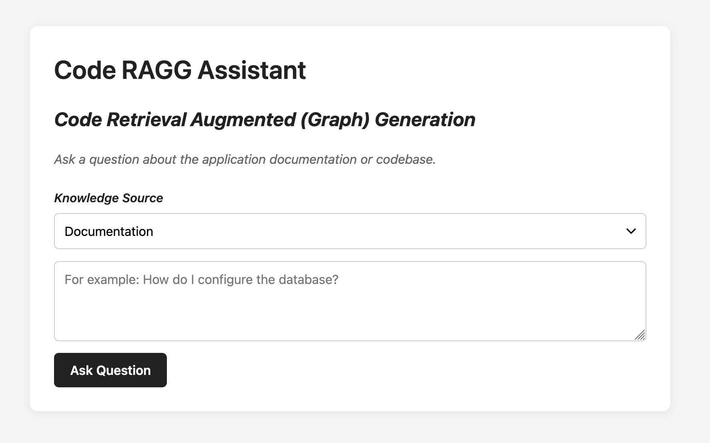

# Code-RAGG

### RAGG (Retrieval Augmented Graph-like Generation)

Code-RAGG is a local, AI-powered code assistant that indexes your codebase and documentation to answer questions with minimal token usage through intelligent context retrieval.

**Key Features:**

- **Semantic Code Search** - Find functions, classes, and code symbols using natural language queries
- **Documentation Integration** - Query both your code and documentation simultaneously
- **Local LLM Support** - Run entirely locally with LM Studio for privacy and cost efficiency
- **Hybrid Retrieval** - Combines vector search and code graph analysis for precise context
- **Token Optimization** - Minimizes LLM token usage by providing only relevant code context

## Requirements

Before installing Code-RAGG, ensure you have the following installed on your system:

- **LM Studio** - Download from [LM Studio](https://lmstudio.ai/). Used to run local language models for code analysis and generation.
  - **Text Encoding Model**: Requires a model that encodes to a vector size of 768, such as `text-embedding-nomic-embed-text-v1.5@q4_k_m`
  - **Reasoning Model**: A small language model for code analysis, such as `qwen/qwen2.5-9b` or smaller
- **PostgreSQL** - Required for storing code embeddings and metadata. Install via:
  - macOS: `brew install postgresql`
  - Linux: `sudo apt-get install postgresql postgresql-contrib`
  - Or use Docker: `docker run -d -p 5432:5432 -e POSTGRES_PASSWORD=postgres postgres:latest`

- **OpenAI API Key** (Optional) - Only required if you want to integrate this system with OpenAI's services. Set the `OPENAI_API_KEY` environment variable if using OpenAI models instead of local models.

## Installation and Configuration

### 1. Install Dependencies

Clone the repository and install npm dependencies:

```bash
npm install
```

### 2. Configure Environment Variables

Copy the example environment file and update it with your configuration:

```bash
cp .env.example .env
```

Edit the `.env` file and update the following parameters:

**Required for LM Studio:**

- `LM_STUDIO_URL` - Your LM Studio API endpoint (default: `http://localhost:1234/v1`)
- `EMBEDDING_MODEL` - Text embedding model name (e.g., `text-embedding-nomic-embed-text-v1.5@q4_k_m`)
- `CHAT_MODEL` - Reasoning/chat model name (e.g., `qwen/qwen2.5-9b`)

**Required for PostgreSQL:**

- `DB_NAME` - Your PostgreSQL database name
- `DB_HOST` - Database host (usually `localhost`)
- `DB_USER` - Database user
- `DB_PASSWORD` - Database password
- `DB_PORT` - Database port (usually `5432`)

**Optional:**

- `OPENAI_API_KEY` - Only if using OpenAI instead of LM Studio
- `PORT` - Server port (default: `3000`)
- Search sensitivity parameters: `PG_SEARCH_LIMIT`, `RERANK_THRESHOLD`, `CODE_RERANK_THRESHOLD`, etc.

### 3. Set Up the Database

Run the database schema setup:

```bash
npm run install-db
```

### 4. Ingest Files and Code

To index your codebase and documents for the RAG system, run both ingest commands:

**Configuration:**

The ingestion process uses the following environment variables to determine what to ingest:

- `CODE_SOURCE_DIRECTORY` - The directory containing your source code files (default: `src`)
- `CODE_SKIP_DIRECTORIES` - Directories to skip during code ingestion (default: `node_modules,.git,dist,build,coverage,tests`)
- `CODE_EXTENSIONS` - File extensions to include in code ingestion (default: `ts,tsx,js,jsx`)

Make sure these are properly configured in your `.env` file before running the ingest commands.

**Step 4a: Ingest Documents**

```bash
npm run ingest
```

This command reads from the documents folder (configured via environment variables) and ingests markdown documentation files into your database for semantic search.

**Step 4b: Ingest Code**

```bash
npm run ingestCode
```

This command reads from your source code directory (configured via environment variables) and ingests code files into your database.

> **Note:** Code ingestion currently only works with JavaScript family source code (JavaScript, TypeScript, JSX, TSX, etc.) - anything that the TypeScript compiler can parse. Support for other languages may be added in future versions.

**What these commands do:**

- Parse your source code files and documentation
- Extract code entities (functions, classes, variables)
- Generate embeddings for semantic search
- Build the code graph for context-aware retrieval

### 5. Start the Server

Start the Code-RAGG server:

```bash
npm run dev
```

The server will start on `http://localhost:3000` by default.

Ensure:

- LM Studio is running with a model loaded
- PostgreSQL is accessible
- Your database is properly configured

## How to Use

### API Endpoints

Code-RAGG exposes several REST API endpoints for querying your codebase and documents:

**Base URL:** `http://localhost:3000/api`

#### 1. Chat with Documents

Query your documentation and ingested documents.

**Endpoint:** `POST /chat`

**Request Body:**

```json
{
  "question": "How do I configure the database?"
}
```

**cURL Example:**

```bash
curl -X POST http://localhost:3000/api/chat \
  -H "Content-Type: application/json" \
  -d '{"question": "How do I configure the database?"}'
```

**Fetch Example:**

```javascript
const response = await fetch("http://localhost:3000/api/chat", {
  method: "POST",
  headers: { "Content-Type": "application/json" },
  body: JSON.stringify({ question: "How do I configure the database?" }),
});
const data = await response.json();
console.log(data.answer);
console.log(data.sources);
```

**Response:**

```json
{
  "answer": "...",
  "sources": [
    {
      "file": "configuration.md",
      "chunk": 0,
      "score": 0.85,
      "rerankerScore": 0.92
    }
  ]
}
```

#### 2. Stream Chat with Documents

Stream the response from a documentation query (useful for long responses).

**Endpoint:** `POST /chat/stream`

**Request Body:**

```json
{
  "question": "How do I configure the database?"
}
```

**cURL Example:**

```bash
curl -X POST http://localhost:3000/api/chat/stream \
  -H "Content-Type: application/json" \
  -d '{"question": "How do I configure the database?"}'
```

**Fetch Example:**

```javascript
const response = await fetch("http://localhost:3000/api/chat/stream", {
  method: "POST",
  headers: { "Content-Type": "application/json" },
  body: JSON.stringify({ question: "How do I configure the database?" }),
});

const reader = response.body.getReader();
const decoder = new TextDecoder();
let result = "";

while (true) {
  const { done, value } = await reader.read();
  if (done) break;
  result += decoder.decode(value);
  console.log(decoder.decode(value));
}
```

**Response:** Server-Sent Events (SSE) stream with events: `sources`, `data`, `usage`, `done`

#### 3. Chat with Code

Ask questions about your codebase with code-aware context.

**Endpoint:** `POST /code/chat`

**Request Body:**

```json
{
  "question": "What functions handle database queries?"
}
```

**cURL Example:**

```bash
curl -X POST http://localhost:3000/api/code/chat \
  -H "Content-Type: application/json" \
  -d '{"question": "What functions handle database queries?"}'
```

**Fetch Example:**

```javascript
const response = await fetch("http://localhost:3000/api/code/chat", {
  method: "POST",
  headers: { "Content-Type": "application/json" },
  body: JSON.stringify({ question: "What functions handle database queries?" }),
});
const data = await response.json();
console.log(data.answer);
console.log(data.sources);
```

**Response:**

```json
{
  "answer": "...",
  "sources": [
    {
      "file": "src/db.ts",
      "symbol": "queryDatabase",
      "type": "function",
      "startLine": 42,
      "endLine": 65,
      "retrieval": "hybrid",
      "rerankerScore": 0.88
    }
  ]
}
```

#### 4. Stream Chat with Code

Stream the response from a code query.

**Endpoint:** `POST /code/chat/stream`

**Request Body:**

```json
{
  "question": "What functions handle database queries?"
}
```

**cURL Example:**

```bash
curl -X POST http://localhost:3000/api/code/chat/stream \
  -H "Content-Type: application/json" \
  -d '{"question": "What functions handle database queries?"}'
```

**Fetch Example:**

```javascript
const response = await fetch("http://localhost:3000/api/code/chat/stream", {
  method: "POST",
  headers: { "Content-Type": "application/json" },
  body: JSON.stringify({ question: "What functions handle database queries?" }),
});

const reader = response.body.getReader();
const decoder = new TextDecoder();

while (true) {
  const { done, value } = await reader.read();
  if (done) break;
  const text = decoder.decode(value);
  console.log(text);
}
```

**Response:** Server-Sent Events (SSE) stream with events: `sources`, `data`, `usage`, `done`

For more detailed API specifications, refer to [API Documentation](./documents/api.md)

- `POST /query` - Ask questions about your code with context
- `GET /context` - Get context information for specific code symbols
- `POST /ingest` - Trigger code ingestion

Refer to [API Documentation](./documents/api.md) for detailed endpoint specifications.

### Web Interface



Access the **Code-RAGG Assistant** web interface:

- Open `http://localhost:3000` in your browser
- Use the interactive chat interface to query your codebase
- The assistant combines RAG (Retrieval-Augmented Generation) with your local code context

The web interface is located in the [public](./public) folder and uses the API endpoints above to provide real-time code insights.
